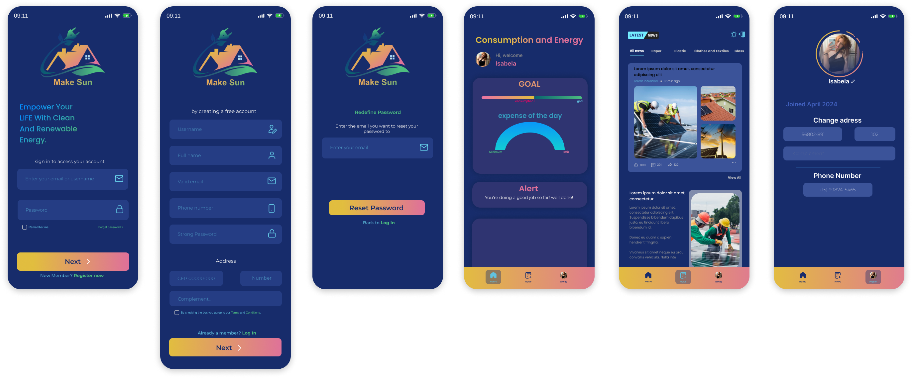

<h1 align="left"><b>Make Sun </b></h1>

## O que é Make Sun?
Make Sun é um aplicativo de monitoramento de consumo e gasto de energia, conectado a uma base de dados gerada pelos controladores das placas solares, direcionado principalmente para residências e pequenos comércios. O objetivo é proporcionar uma ferramenta abrangente que permita aos usuários monitorar e otimizar seu uso de energia de forma sustentável e eficiente, além de promover a conscientização sobre sustentabilidade e energia renovável.

 

<h1 align="center" style="margin-bottom: 70px;">Make Sun app prototype on Figma Mobile</h1>

 
